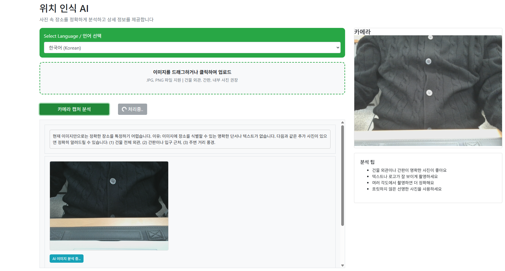
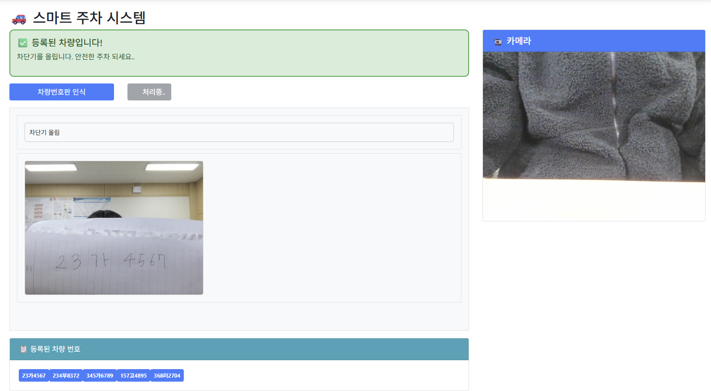
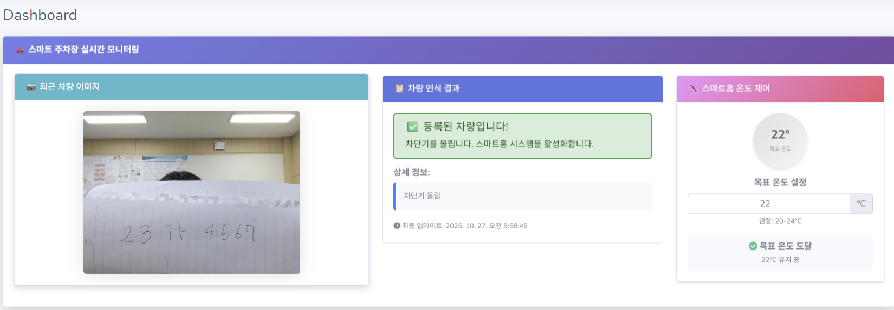

# 여행 

---

## 👥 팀원

- 🧑 [김형경]
- 🧑 [문태건]
- 🧑 [신인철]
- 🧑 [이태준]

---

## 🎯 주제

Spring AI를 활용한 통합 여행 도우미 웹 애플리케이션

---

## 🛠 사용 기술

### ✅ Frontend
- HTML / CSS / JavaScript
- JSP / JSTL
- Bootstrap
- FullCalendar
- jQuery

### ✅ Backend
- Java (Spring Framework)
- Spring AI

### ✅ AI/ML
- GPT (텍스트 생성)
- DALL-E (이미지 생성)
- Whisper (음성 인식)
- TTS (음성 합성)
- Vision API (이미지 분석)

### ✅ External APIs
- Exchange Rate API (환율 정보)

### ✅ Tools
- IntelliJ IDEA / GitHub

---

## 💡 주요 기능 (Features)

### 🗺️ 여행 일정 생성 (ai1.jsp)
- **자동 일정 생성**: 지역명 입력 시 AI가 맞춤형 여행 일정 자동 생성
- **캘린더 연동**: FullCalendar 라이브러리를 통한 직관적인 일정 시각화
- **상세 정보 제공**: 각 장소별 시간, 설명, 여행 팁 포함
- **예시 질문**: "천안 당일치기 코스", "제주도 2박3일 여행" 등

### 🎨 작품 해설 AI (springai3/ai1.jsp)
- **실시간 카메라**: 웹캠을 통한 실시간 작품 촬영
- **다국어 지원**: 한국어, 영어, 일본어, 중국어 해설 지원
- **음성 안내**: TTS 기술로 박물관 가이드처럼 친근한 음성 해설
- **작품 분석**: 작가, 역사적 배경, 예술 기법, 흥미로운 일화 제공
- **대시보드 연동**: 분석 결과를 관리자 대시보드로 자동 전송

### 🌐 실시간 통역 (springai3/ai2.jsp)
- **자동 언어 감지**: 사용자 음성의 언어를 자동으로 인식
- **다국어 번역**: 한국어 ↔ 영어 ↔ 일본어 ↔ 중국어 실시간 번역
- **음성 입출력**: 말하면 바로 번역된 음성으로 재생
- **시각적 표시**: 원문과 번역문을 함께 표시하여 학습 효과 제공

### 🍽️ 현지 음식 추천 (springai3/ai3.jsp)
- **AI 맞춤 추천**: 여행 국가 입력 시 대표 음식 3가지 자동 추천
- **상세한 설명**: 맛, 재료, 먹는 방법, 여행객을 위한 팁 제공 (70자 이상)
- **이미지 자동 생성**: DALL-E를 활용한 음식 이미지 생성
- **시각적 구성**: 추천 음식과 생성된 이미지를 카드 형태로 표시

### 💰 AI 가계부 & 환전 (springai3/ai4.jsp)
- **음성/텍스트 입력**: "오늘 스타벅스 7천원 지출" 같은 자연어 입력
- **자동 분류**: AI가 날짜, 금액, 카테고리를 자동으로 추출하여 등록
- **캘린더 통합**: FullCalendar에 지출/수입 내역 시각화
- **자동 환전**: 10개 주요 통화의 실시간 환율 정보 제공 및 자동 변환
    - USD, JPY, EUR, CNY, VND, THB, PHP, TWD, HKD, AUD 지원
- **내역 관리**: 카테고리 필터링, 검색, 수정, 삭제 기능
- **통계**: 총 수입/지출 자동 계산 및 표시

### 📍 위치 인식 AI (springai3/ai5.jsp)
- **정밀 장소 인식**: 사진 속 건물, 박물관, 식당 등을 정확하게 식별
- **다중 입력 방식**: 카메라 캡처 또는 이미지 파일 업로드 (드래그 앤 드롭 지원)
- **상세 정보 제공**: 장소명, 주소, 연락처, 신뢰도 표시
- **맞춤 추천**: 해당 장소에서의 추천 항목 3가지 제공
- **다국어 지원**: 한국어, 영어, 일본어, 중국어 분석 및 안내

### 🚗 스마트 주차장 시스템 (springai3/ai9.jsp)

- **실시간 카메라 모니터링**: 웹캠을 통한 실시간 차량 번호판 촬영
- **AI 차량 인식**: Vision API를 활용한 자동 번호판 인식
- **차단기 자동 제어**: 등록된 차량 판별 후 차단기 자동 개폐
- **등록 차량 관리**: 사전 등록된 차량 번호 리스트 표시

- **실시간 상태 표시**: 인식 성공/실패 시각적 피드백
- **관리자 서버 연동**: Base64 이미지와 인식 결과를 Admin 서버로 전송
### 🏠 스마트홈 대시보드 (admin/src/main/webapp/views/center.jsp)

- **실시간 모니터링**:SSE를 통한 차량 입차 정보 실시간 수신
- **자동 온도 제어**: 등록 차량 입차 시 스마트홈 온도 자동 조절
- **온도 설정**: 18°C ~ 30°C 범위 내 목표 온도 설정 (권장: 20-24°C)


상세 정보: 차량 인식 결과, 시간, 상태 로그
---

## ⚙ 기술적 특징

### 🔊 음성 처리
- **STT (Speech-to-Text)**: Whisper API를 통한 음성 인식
- **TTS (Text-to-Speech)**: 자연스러운 음성 합성
- **실시간 처리**: 음성 입력 후 즉시 분석 및 응답

### 🖼️ 이미지 처리
- **Vision API**: GPT Vision을 통한 이미지 내용 분석
- **DALL-E**: 프롬프트 기반 고품질 이미지 생성
- **캔버스 캡처**: HTML5 Canvas를 이용한 실시간 프레임 캡처

### 📅 데이터 시각화
- **FullCalendar**: 일정 및 가계부 내역을 캘린더 형태로 표시
- **동적 차트**: 수입/지출 통계를 실시간으로 계산 및 표시
- **반응형 디자인**: 모바일 및 데스크톱 환경 모두 지원

### 🌍 국제화 (i18n)
- **4개 언어 지원**: 한국어, 영어, 일본어, 중국어
- **동적 프롬프트**: 선택된 언어에 따라 AI 프롬프트 자동 변경
- **현지화된 UI**: 언어별 버튼, 메시지, 안내문 제공

---

## 📂 프로젝트 구조

```
shop/src/main/webapp/views/
├── springai1/
│   └── ai1.jsp              # 여행 일정 생성
├── springai3/
│   ├── ai1.jsp              # 작품 해설 AI
│   ├── ai2.jsp              # 실시간 통역
│   ├── ai3.jsp              # 현지 음식 추천
│   ├── ai4.jsp              # AI 가계부 & 환전
│   └── ai5.jsp              # 위치 인식 AI
│   └── ai9.jsp              # AI 주차 시스템
```

---

## 🚀 주요 API 엔드포인트

### 여행 일정
- `/ai1/few-shot-prompt` - 여행 일정 생성

### 작품 해설
- `/ai3/image-analysis2` - 이미지 분석 및 해설

### 실시간 통역
- `/ai3/translate` - 음성 번역

### 음식 추천
- `/ai3/chat-text` - 음식 추천 텍스트 생성
- `/ai3/image-generate` - 음식 이미지 생성

### 가계부
- `/ai3/accountbook` - 가계부 내역 자동 분류
- `/ai3/stt` - 음성을 텍스트로 변환
- `/ai3/tts` - 텍스트를 음성으로 변환

### 위치 인식
- `/ai3/image-analysis2` - 장소 식별 및 분석
### 주차장 관리 시스템

-   Shop 서버 (차량 인식)

- POST /ai5/boom-barrier-tools

- 차량 번호판 이미지 분석 및 인식
- 입력: MultipartFile (이미지)
- 출력: 인식 결과 텍스트 (차량번호, 등록 여부, 차단기 제어 명령)

- Admin 서버 (데이터 수신 및 제어)

- GET /sse/connect/{adminId}

- SSE 연결 생성 및 실시간 데이터 스트리밍
- POST /aimsg2

- 차량 인식 결과 수신 및 브로드캐스트
- 입력: JSON (차량번호, 인식결과, Base64 이미지, 타임스탬프)

- GET /ai5/heating-system-tools

- 스마트홈 온도 제어 시스템
- 입력: question (목표 온도 명령)
- 출력: 난방/냉방 제어 결과

---

###  브라우저 접속
```
ex) https//127.0.0.1:8443/
```

---

## 📸 주요 화면

### 여행 일정 생성


### 작품 해설 AI


### 실시간 통역

### 현지 음식 추천


### AI 가계부


### 위치 인식


###  AI 주차 시스템



---
### 유튜브 시연 영상
[[2조 미니 프로젝트]](https://youtu.be/9i1OFRpKQAs)
---
